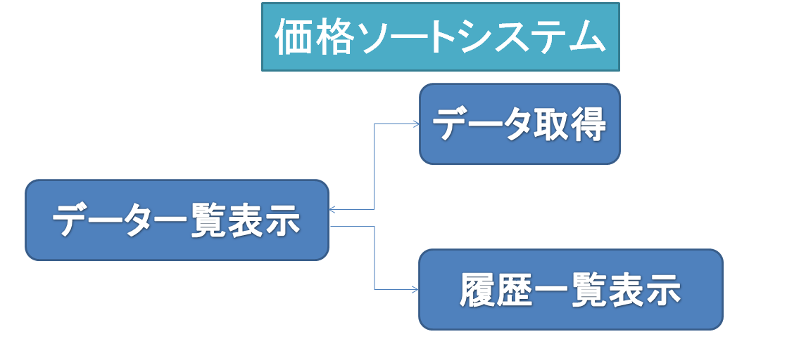
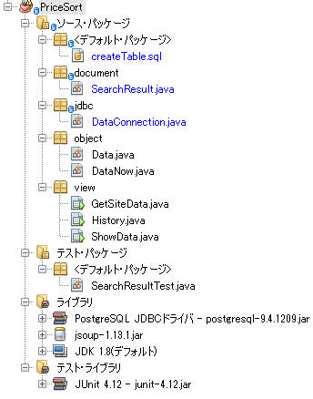
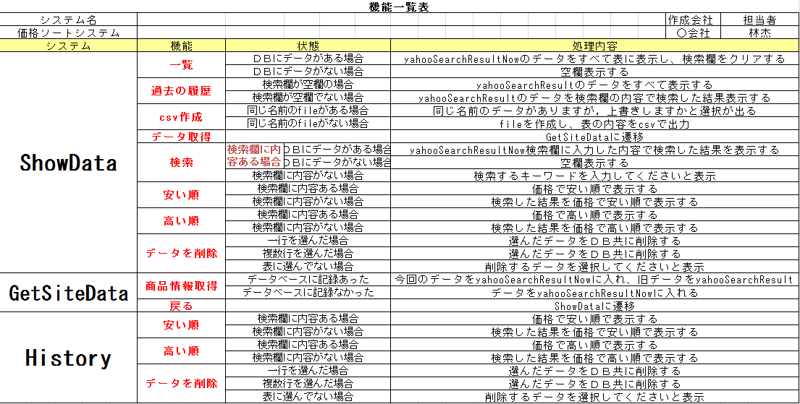
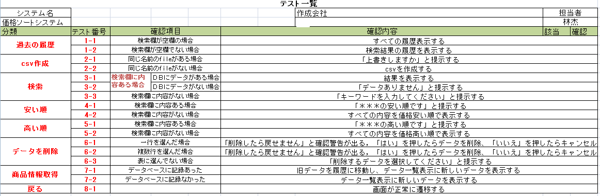
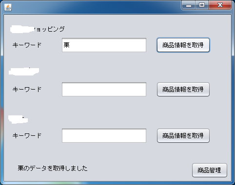
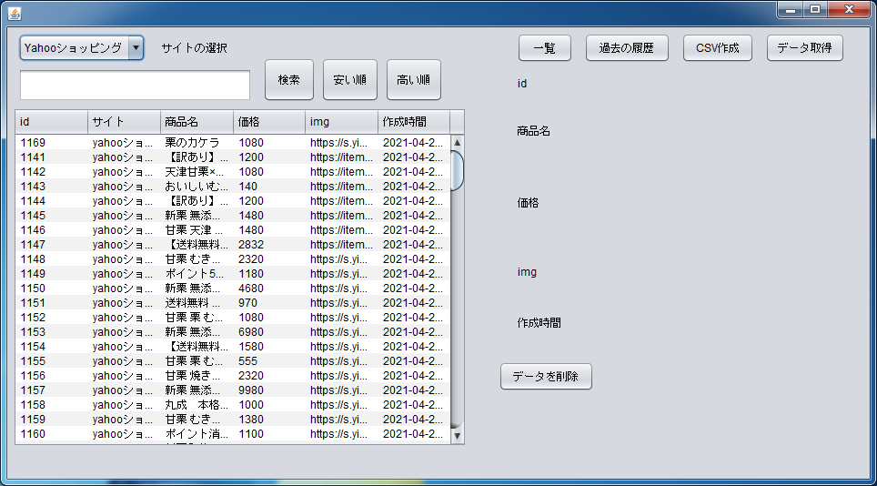

# priceSort
「価格ソート」

「価格ソート」はNetBeans、Jsoupを利用して，ECサイトのデータをスクレイピングするアプリです。サイトでキーワード検索したデータを取得（５ページ）、表示、ソート、キーワード検索、削除します。

開発期間は約１ヶ月です。

# 1．開発環境

1-1　IDE:NetBeans 8.2バージョン

1-2　OS:Windows7

1-3　データベース:PostgreSQL

1-4　ソース管理:Githubを利用

1-5　テスト:Junit

1-6　その他:ソースコードはUTF-8で作成する。

CSVファイルはSHIFT_JISで作成する。（excelからCSV形式で保存したときの標準）

# 2．画面

画面遷移図と画面は以下となります：

#### 2-1．画面遷移図

#### 2-2．データ一覧表示画面

画面レイアウト：

#### 2-3．履歴一覧表示

画面レイアウト：

#### 2-4．データ取得

画面レイアウト：

# 3．構成

プロジェクト構成は下記の通りです。

# 4．実践

「栗」を検索してみます：

「商品管理」を押したら

「安い順」を押したら

削除してみます

csvを作成します

